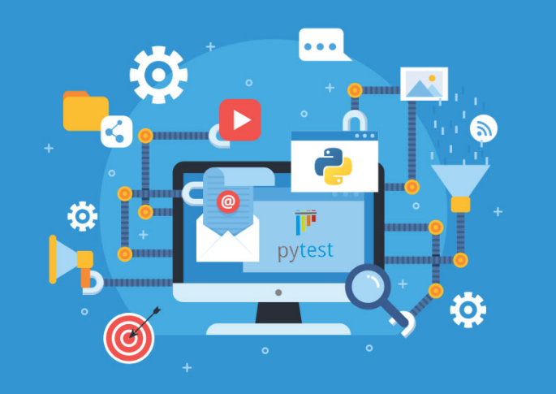

# Core-Python | Discovering Python testing capabilities 

This app covers an introduction to good test design and patterns for good automation code.

Python is a great langauge for Test Automation and lets testers focus more upon the test and less on the code. At the heart of any functional test automation project is the core test framework. The framework handles the following;

- Test case structure
- Test execution
- Pass / fail result reporting 

Test cases are written as functions, not classes. Test assertion failures are reported with actual values. 

***

**Get Started:**

- Download Python3 on your machine
- Create a new project directory
    - `mkdir python-webui-testing`
    - `cd python-webui-testing`

- Create a virtual environment for your new projects dependencies. This will save upon your machine avoiding conflicting package versions
    - `pip3 install pipenv` 

- Install pytest for new project
    - `pipenv install pytest --dev`

***

